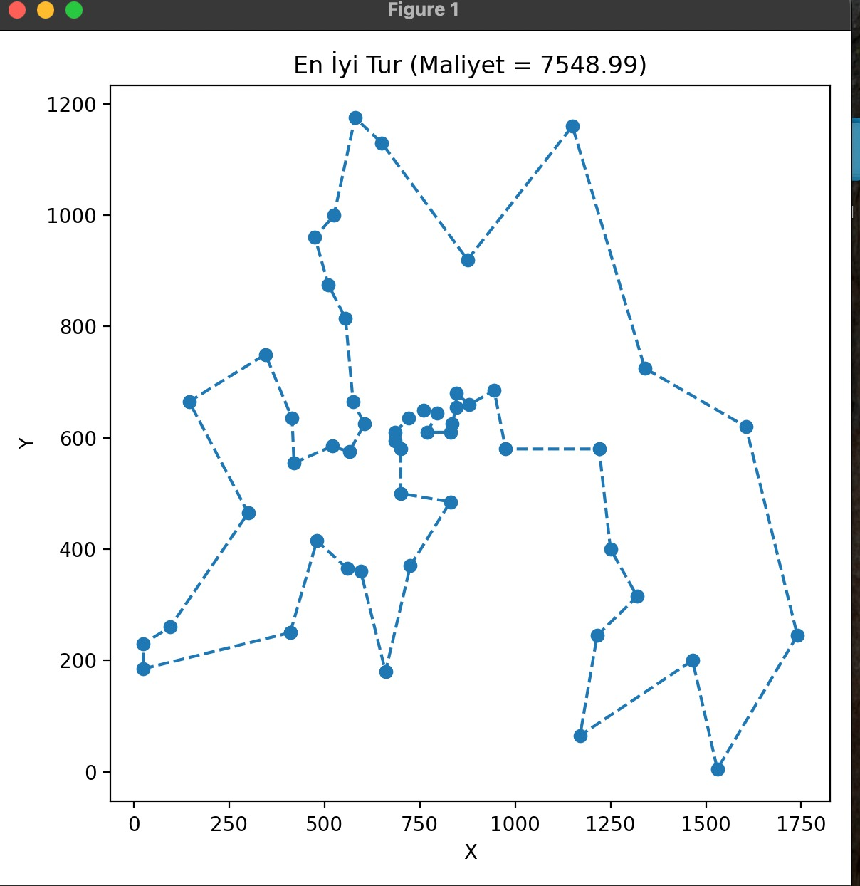
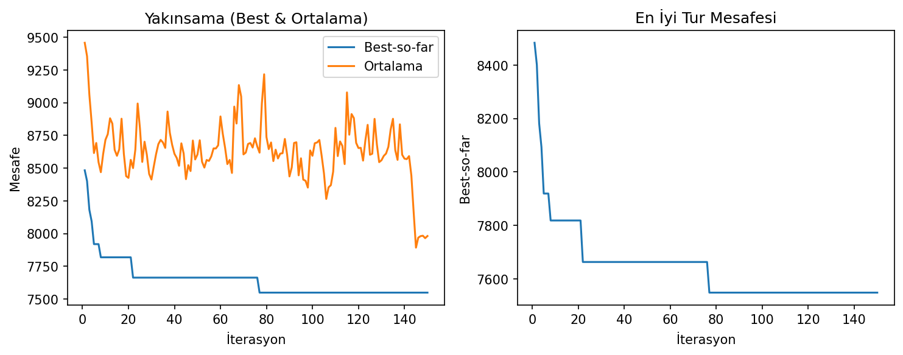
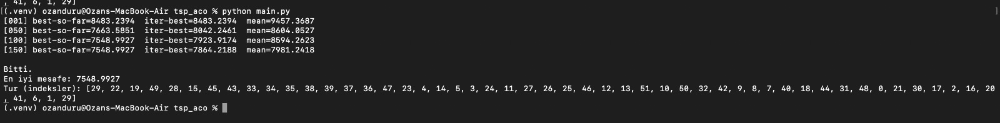

# Traveling Salesman Problem (TSP) - Ant Colony Optimization (ACO)

This project implements an Ant Colony Optimization algorithm to solve the Traveling Salesman Problem, specifically using the Berlin52 benchmark problem.

## Overview

The Ant Colony Optimization (ACO) algorithm is a metaheuristic approach inspired by the foraging behavior of ants. Ants deposit pheromones on paths they traverse, and other ants are more likely to follow paths with stronger pheromone trails. This behavior is simulated to find optimal or near-optimal solutions to the TSP.

## Problem: Berlin52

Berlin52 is a well-known TSP benchmark problem containing 52 cities in Berlin. The optimal solution for this problem has a tour length of approximately 7542 units.

## Installation

1. Clone the repository:
```bash
git clone <repository-url>
cd tsp_aco
```

2. Install required dependencies:
```bash
pip install -r requirements.txt
```

## Dependencies

- `numpy` - Numerical computations
- `pandas` - Data handling
- `matplotlib` - Plotting and visualization
- `dataclasses` - Configuration management (built-in Python module)

## Usage

Run the algorithm with default parameters:

```bash
python main.py
```

### Custom Configuration

You can modify the parameters in `main.py`:

```python
cfg = ACOConfig(
    iterations=150,      # Number of iterations
    colony_size=50,      # Number of ants in the colony
    evap_coeff=0.10,     # Pheromone evaporation coefficient
    alpha=9,             # Pheromone importance parameter
    beta=12,             # Heuristic information importance parameter
    initial_tau=1e-4,    # Initial pheromone value
    Q=0.2,               # Pheromone deposit factor
    el=0.97,             # Elitism factor
    data_path="data/berlin52.csv",
    random_seed=42       # Random seed for reproducibility
)
```

## Parameters

### Algorithm Parameters

- **`iterations`** (int): Number of algorithm iterations. More iterations generally lead to better solutions but require more computation time.
  - Default: `100`
  - Recommended: `100-200`

- **`colony_size`** (int): Number of ants in the colony. More ants explore more solutions per iteration.
  - Default: `50`
  - Recommended: `30-100`

- **`evap_coeff`** (float): Pheromone evaporation coefficient (ρ). Controls how quickly pheromone trails fade.
  - Default: `0.10`
  - Range: `0.0-1.0`
  - Higher values = faster evaporation, more exploration

- **`alpha`** (float): Pheromone importance parameter. Controls the influence of pheromone trails on path selection.
  - Default: `9.0`
  - Recommended: `1-10`
  - Higher values = stronger influence of pheromone

- **`beta`** (float): Heuristic information importance parameter. Controls the influence of distance (visibility) on path selection.
  - Default: `12.0`
  - Recommended: `5-15`
  - Higher values = stronger preference for shorter distances

- **`initial_tau`** (float): Initial pheromone value on all edges.
  - Default: `1e-4`
  - Small positive value to start the algorithm

- **`Q`** (float): Pheromone deposit factor. Controls the amount of pheromone deposited by ants.
  - Default: `0.2`
  - Recommended: `0.1-1.0`

- **`el`** (float): Elitism factor. Controls the reinforcement of the best tour found so far.
  - Default: `0.97`
  - Range: `0.0-1.0`
  - Higher values = stronger emphasis on best solution

- **`data_path`** (str): Path to the TSP data file (CSV format with x, y coordinates).
  - Default: `"./data/berlin52.csv"`

- **`random_seed`** (int | None): Random seed for reproducibility. Set to `None` for true randomness.
  - Default: `42`

## Output

The algorithm produces:

1. **Console Output**: Progress information showing:
   - Iteration number
   - Best-so-far distance
   - Iteration-best distance
   - Average distance of all ants

2. **Visualizations**:
   - **Best Route Plot**: Displays the best tour found, showing all cities and the path connecting them.
   - **Convergence Graphs**: Shows the evolution of:
     - Best-so-far distance over iterations
     - Average distance over iterations

## Results Visualization

### Best Path

The best path visualization shows the optimal tour connecting all 52 cities:
- All cities are displayed as scatter points
- The tour path connects all cities in the optimal order
- The total tour distance is displayed



### Convergence Graphs

The convergence graphs show the algorithm's performance over iterations:
- **Left plot**: Comparison of best-so-far and average distances over iterations
- **Right plot**: Detailed view of best-so-far distance improvement

These graphs help analyze:
- Algorithm convergence rate
- Solution quality improvement over time
- Exploration vs exploitation balance



### Terminal Results

The terminal output displays real-time progress information:
- Iteration number
- Best-so-far distance found
- Iteration-best distance
- Average distance of all ants in the colony



## Project Structure

```
tsp_aco/
├── main.py                 # Main entry point
├── requirements.txt        # Python dependencies
├── README.md              # This file
├── best_route.png         # Best route visualization
├── data/
│   ├── berlin52.csv       # City coordinates (CSV format)
│   └── berlin52.tsp       # Original TSP file
└── src/
    ├── __init__.py
    ├── config.py          # Configuration dataclass
    ├── ant_system.py      # Main ACO algorithm
    ├── tour_construction.py # Tour construction logic
    ├── pheromone.py       # Pheromone update mechanism
    ├── cost.py            # Cost calculation
    ├── io_utils.py        # Data loading and preprocessing
    └── plotting.py        # Visualization functions
```

## Algorithm Flow

1. **Initialization**: Load city coordinates and initialize pheromone matrix
2. **Tour Construction**: Each ant constructs a tour using probabilistic path selection
3. **Cost Calculation**: Compute tour costs and identify best solutions
4. **Pheromone Update**: Update pheromone trails based on tour quality
5. **Evaporation**: Apply pheromone evaporation
6. **Iteration**: Repeat steps 2-5 for specified number of iterations
7. **Visualization**: Plot results and convergence graphs

## Expected Results

For the Berlin52 problem with default parameters:
- **Optimal distance**: ~7542 units
- **Typical result**: ~7600-7800 units (depending on parameters and random seed)
- **Convergence**: Usually converges within 100-150 iterations

## References

- Berlin52 TSP benchmark: Standard test problem in TSP literature
- Ant Colony Optimization: Metaheuristic algorithm for combinatorial optimization
- Traveling Salesman Problem: Classic NP-hard optimization problem


## Author

Ozan Duru

